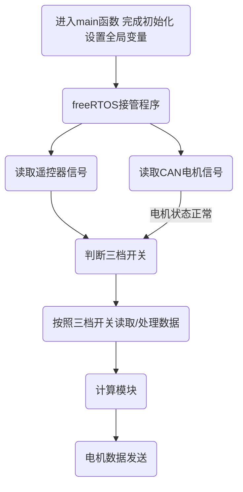
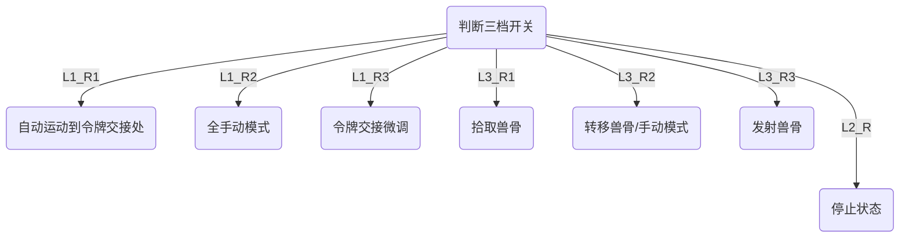
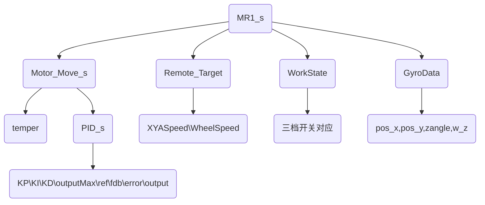

# MR1 代码分析 

File		：MR1-V6.0

Author	: 任云帆

E-mail	：ryf_hitsz@163.com

## 更新说明

| 版本号 | 更新日期  | 操作人  | 更新内容 |
| ------ | --------- | ------- | -------- |
| v6.1   | 2019/2/28 |  任云帆  | 更新了陀螺仪解码函数，MR1结构体中增加了陀螺仪信息。 |
|        |           |         |          |
|        |           |         |          |


## 声明

```c
- 1.本代码基于STM32F427IIH6开发，编译环境为Keil 5，基于FreeRTOS进行开发。
- 2.本代码只适用于Robocon 2019MR1机器人，不建议用于其他用途
- 3.本代码以UTF-8格式编码，请勿以ANSI编码形式打开
- 4.本代码最终解释权归哈尔滨工业大学（深圳）Robocon战队所有
- Copyright (c) 2019 哈尔滨工业大学（深圳）Robocon战队 版权所有					
```

## 0 作者说明

​	本代码为2019robocon比赛MR1半自动机器人设计。采用软件工程常用的模块分离思想，将工程分为输入、输出、处理、支持等四个部分。其中输入输出包含了基于CAN总线的电机控制和基于USART串口通讯的遥控器以及陀螺仪数据传输；处理模块包含了主要功能源文件（Mission.c）和全局变量初始化源文件（MR1Init.c）；支持模块包含了PID计算，独立看门狗等。由于工程量较小，为了保证变量的整齐，我尽量的将有用的变量整合到MR1_s结构体中，方便全局变量的共享。代码整体构成结构清晰，方便后续的功能添加。为保证迭代开发的一致性，下面对文件名和变量名的命名进行规范。

**命名规范**

| 类型     | 命名方式                             | 举例                        |
| -------- | ------------------------------------ | --------------------------- |
| 文件名   | 首字母大写                           | Mission.c                   |
| 结构体   | 统一使用typedef，并且在名称后面加 _s | typedef struct {} MR1_s;    |
| 枚举类型 | 统一使用typedef，并且在名称后面加 _e | typedef enum {} WorkState_e |
| 宏定义   | 全部使用大写 | #define LENGTH 30 |

## 1  控制板配置

见文件：2019RC_MR1.pdf

## 2 外部资源调度

- CAN总线两个
- USART两个 分别用于接收遥控器消息 和陀螺仪消息
- freeRTOS三个线程 一个用于主运动 一个备用 一个用于LCD状态显示
- 内部时钟TIM7作为freeRTOS控制时钟

## 3 遥控器三档开关说明

|          | 上   | 中   | 下   |
| -------- | ---- | ---- | ---- |
| 左侧开关 | L1   | L2   | L3   |

| 右侧开关 | L1                  | L2         | L3   |
| -------- | -------------------- | ---------- | ---- |
| R1     | 自动运动到交接令牌处 | 停止状态 | 拾取兽骨 |
| R2     | 全手动模式      | 停止状态     | 转移兽骨 |
| R3     | 交接令牌微调 | 停止状态 | 发射兽骨 |

## 4 代码结构


**三档开关功能解析**



## 5 代码解析


### 5.1 Process

​	该组中包含四个文件，除了cube生成的main.c和freertos.c外,还有定义全局变量的VarInit.c和包含所用工作的Mission.c 。其中MR1_s的数据结构如下。




​	包含了所有电机信息、移动信息和状态信息。

​	Mission.c文件中包含了所有MR1的工作函数，并在主循环中通过switch函数判断机器人状态执行相应工作。

### 5.2 Support

​	该组中主要包含了模拟看门狗和PID计算以及LED闪烁功能。

​	看门狗其实就是一个定时器，从功能上说它可以让微控制器在程序发生意外（程序进入死循环或跑飞）的时候，能重新回复到系统刚上电状态，以保障系统出问题的时候可以重启一次。说的复杂一点，看门狗就是能让程序出问题是能重新启动系统。

### 5.3 Receive

​	该组中主要包含了CAN通讯接收和串口通讯接收两个模块，分别接收和解码两组数据。其中UsartReceive解码遥控器信息后，实时改变了MR1的工作状态。陀螺仪数据帧如下：


### 5.4 Send

​	该组目前仅有一个文件SendSignal.c，仅包含CAN通讯的输出函数，发布电机电流信号。

## 6 致谢

- 感谢：谢胜提供代码编写思路
- 感谢：陆伟建整理代码思路
- 感谢：王震东等提供PID算法
- 感谢：欧阳俊源提供字符串命令解码算法
- 感谢：刘朝晖、林靖等提供四轮小车轮速模型

## 报错解决

1）

```c
Member reference base type 'int' is not a structure or union
    解决:extern 变量时没有带上错误类型
 错误写法: extern MR1
 正确写法: extern MR1_s MR1
```


2）没有打开电源供电导致遥控器无法接收。

3）没有为开发板提供动力电源导致CAN信号无法接受

4）在主循环中加入Delay导致PID计算跑飞，电机工作不正常。

5）串口接收中断启用多次失败，改用DMA得以解决。

6）字符串截断问题

​	目前无法实现随机字符串的读写，只能严格定义HAL_UART_Receive_DMA(&huart2,rxBuffer,10u);中的字符串长度和发送的字符串长度相等。这样才能完整，完美的覆盖字符串内容。

​	如果长度不一致的话，目测系统采用的是循环覆盖的方法，即缓冲区满后从头开始覆盖，可能会导致大量的信息丢失。

7）未在主循环中加入osDelay（1）导致程序跑飞、电机微小抖动。